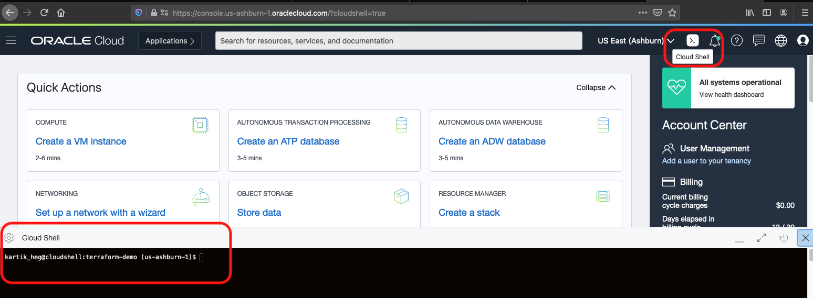
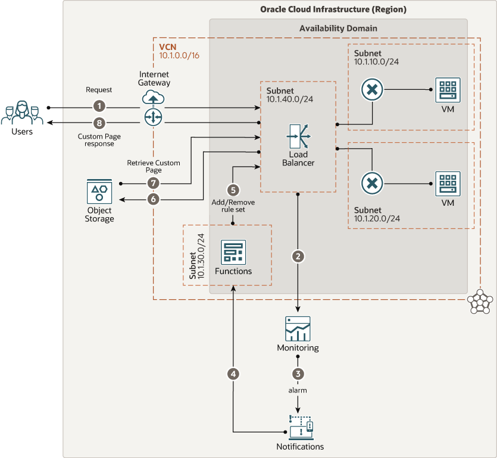

# oci-arch-lbs-custom-error

Oracle Cloud Infrastructure Load Balancing service improves resource utilization, facilitates scaling, and ensures high availability. You can configure multiple load balancing policies and application-specific health checks to ensure that the load balancer directs traffic only to healthy instances. If one or more of the back-end servers report as unhealthy, a user trying to access the load balancer listener receives a standard error code and message as a response. However, by using Oracle Cloud Infrastructure Monitoring, Oracle Cloud Infrastructure Notifications, and Oracle Functions services, end-users can be served with a custom error page hosted by Oracle Cloud Infrastructure Object Storage service. This reference architecture showcases such a scenario to provide a better end-user experience.

## Terraform Provider for Oracle Cloud Infrastructure
The OCI Terraform Provider is now available for automatic download through the Terraform Provider Registry. 
For more information on how to get started view the [documentation](https://www.terraform.io/docs/providers/oci/index.html) 
and [setup guide](https://www.terraform.io/docs/providers/oci/guides/version-3-upgrade.html).

* [Documentation](https://www.terraform.io/docs/providers/oci/index.html)
* [OCI forums](https://cloudcustomerconnect.oracle.com/resources/9c8fa8f96f/summary)
* [Github issues](https://github.com/terraform-providers/terraform-provider-oci/issues)
* [Troubleshooting](https://www.terraform.io/docs/providers/oci/guides/guides/troubleshooting.html)

## Clone the Module
Now, you'll want a local copy of this repo. You can make that with the commands:

    git clone https://github.com/oracle-quickstart/oci-arch-lbs-custom-error.git
    cd oci-arch-lbs-custom-error
    ls

## Prerequisites
First off, you'll need to do some pre-deploy setup.  That's all detailed [here](https://github.com/cloud-partners/oci-prerequisites).

Secondly, create a `terraform.tfvars` file and populate with the following information:

```
# Authentication
tenancy_ocid         = "<tenancy_ocid>"
user_ocid            = "<user_ocid>"
fingerprint          = "<finger_print>"
private_key_path     = "<pem_private_key_path>"

# SSH Keys
ssh_public_key  = "<public_ssh_key_path>"

# Region
region = "<oci_region>"

# Compartment
compartment_ocid = "<compartment_ocid>"

````

Deploy:

    terraform init
    terraform plan
    terraform apply

## Post-Deployment Setup

### Step 1: Cloud Shell Access

Login to OCI console. Open up the OCI Cloud Shell from the console.




### Step 2: Generate OCIR token

Login to OCI console.

Click on your `Profile` -> `User Settings`. On the bottom left, click on `Auth Tokens`. Click on `Generate Token`.

Provide a discription and then hit `Generate Token`. This will generate a token. Make sure to copy the token and save it for future steps.

### Step 3: Run function commands

On OCI Cloud Shell, run the below commands one after another. Make sure to edit the values where necessery.

1. Select the context for the region you are in:

`fn use context <region> ex: us-phoenix-1`

2. Update the context with the compartment-id:

`fn update context oracle.compartment-id "<COMPARTMENT-OCID>"`

3. `fn update context registry phx.ocir.io/<tenancy_name>/[YOUR-OCIR-REPO]` <-- Replace phx with the three-digit region code

4.	Update the context with the location of the Registry repository that you want to use:
    
    `docker login phx.ocir.io` <-- Replace phx with the three-digit region code
			
You are prompted for the following information:
    * Username: <tenancyname>/<username>
    * Password: OCIR token we had created in earlier steps

Note: If you are using Oracle Identity Cloud Service, your username is <tenancyname>/oracleidentitycloudservice/<username>.

5.	Deploy the add_maintenance function to the MaintenancePage application by first navigate to the add_maintenance folder and then run:

    `fn deploy --app MaintenancePage`

### Step 4: Modify the function code

Next, cd into the folder -> `cd MaintenancePage`

Lets edit the `func.py` file. 

To do that: 

Go to below links and copy the content for the corresponding files and replace them in `func.py`

````
https://gist.github.com/KartikShrikantHegde/1fbb546b96b35883234006201ac267be
````

Now, its time to deploy the function again.

`docker login phx.ocir.io`

Enter the username and password when asked.

`Username` -> `<your-tenancy-namespace>/oracleidentitycloudservice/<your-oci-user-email-here>` (look for namespace in tenancy details on your OCI console for `<your-tenancy-namespace>`)

`Password` -> OCIR token we had created in earlier steps

Lets deploy the updated function. First navigate to the add_maintenance folder and then run:

    `fn deploy --app MaintenancePage`

### Step 5: Add the HTML page

Create a file `maintenance.html` in the cloud shell. Use the below link to copy the code and paste to `maintenance.html` page on the cloud shell terminal.

````
https://gist.github.com/KartikShrikantHegde/cc7bc6706c44bfe688dc9ec386115165
````

Now, Once the bucket has been provisioned using Terraform use the CLI to upload the maintenance page from cloud shell.

    `oci os object put -ns mynamespace -bn mybucket --name maintenance.html --file ./maintenance.html`

Now, if one of the backend servers is down and if you make a request to load balancer, you should be able to see the custom `maintenance.html` as the response.

## Destroy the Deployment
When you no longer need the deployment, you can run this command to destroy it:

    terraform destroy

## Custom Error Page for a Load Balancer Architecture




## Reference Archirecture

- [Implement a custom error page for a load balancer using cloud native services](https://docs.oracle.com/en/solutions/implement-lbaas-error-page/)
